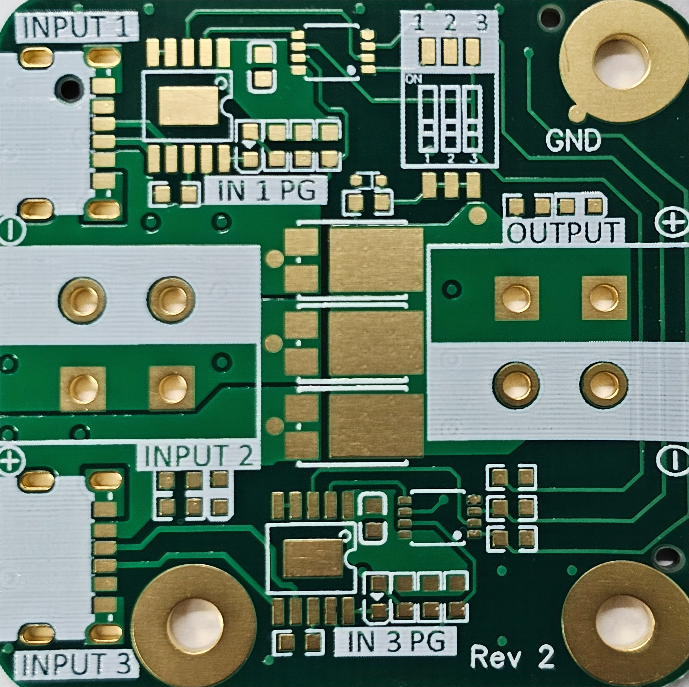

We ordered this board from JLCPCB.com with the following options:
- Stackup: 4 layer JLC04161H-7628
- Thickness: 1.6 mm
- Via covering: Epoxy filled and capped
- Surface finish: ENIG
- Min via hole/size: 0.3/0.4mm
- Remove order number: Yes

Green soldermask was used to be eligible for Economic PCBA.

To manually assemble the board, you can use the BOM and EasyEDA. The gerber files are included in PDF format as well.

     

