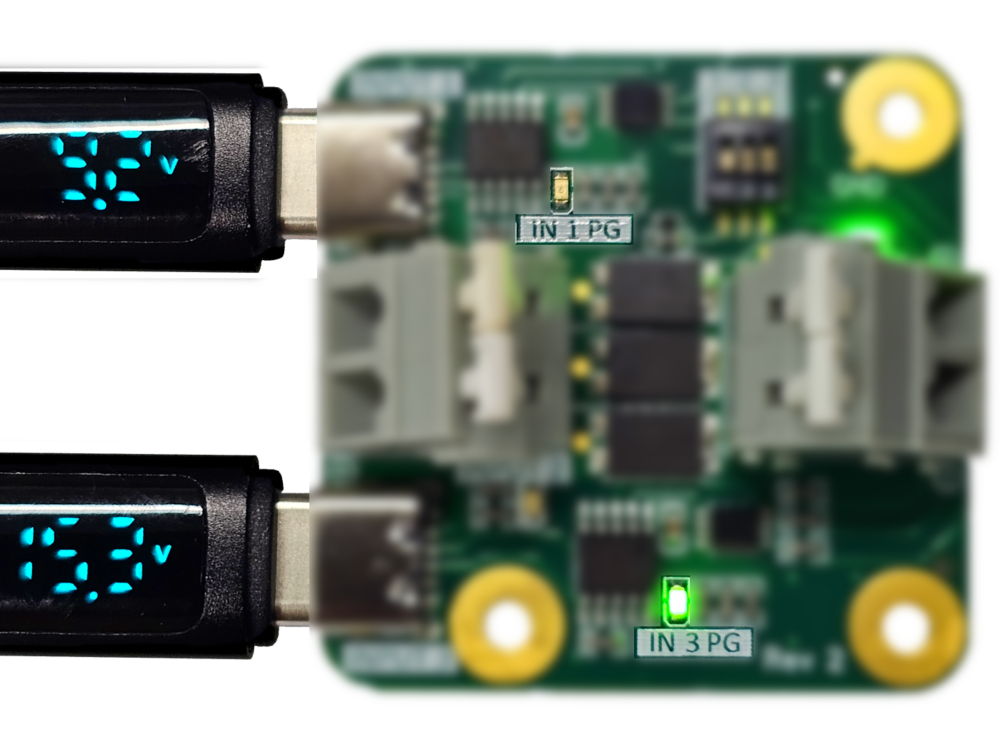

# TII Nexus USB PD

A small tri-input, single output board that gives you redundant power at USB-PD 2.0 voltages.

     

This project came to be when we realized that a lot of our experiments require both portability and/or redundancy, and while USB-PD powerbanks are highly available on the market, we had a problem with swapping them out without powering down the system. 

Even powerbanks that support power output while charging may go offline for some small amount of time when plugged in, which was unacceptable in our scenario. With this board, a second powerbank or generic power supply can be connected to allow the removal of a nearly depleted powerbank. This allow allows for multiple voltage sources to be used to ensure redundancy, and has the advantage of being non-proprietary.

## Specifications
Voltage output with USB input: 5, 9, 12, 15, or 20V

Voltage input/output with Terminal input: 0 - 40V

Current: 0-2A (up-to 5A possible with additional heatsinking)

Due to the use of Schottky diodes, the highest voltage input will be seen at the input minus 0-0.35 V and load sharing is unlikely unless power sources are well matched. The two USB-C inputs work by communicating over CC lines to the CH224K chips which act as decoys and negotiate the selected voltage. When the negotiation is successful, a "Power Good" or "PG" LED lights up to inform the user that the correct voltage is applied to the output.

## Case
A case design is also included in this repository, it is designed to be made by a Nylon SLS 3D printer or a similar high resolution printing technology.

Included on the case is a place where you can mark the set voltage, use a thin object with paint or ink to mark the correct segments, or modify the 3D model if the desired voltage is known.

     

## Make it
You can use the Gerber files attached in this repository, or import the EasyEDA project included in the PCB folder. If you use JLCPCB or any other PCB service that also offers 3D printing, you can order the case along with the PCB.

## Use it
To use this board, you can plug between one and three inputs: The two type C ports and the terminal in between. The output voltage will be the highest of the three input voltage minus a 0 - 0.35 V diode drop. After selecting the correct setting on the DIP switch for the desired output voltage (as shown in the table below), you can plug in a USB C input and check for its respective "PG" LED. 

For example, if you plug a cable into input 1 and the LED that is labeled "IN 1 PG" turns ON, this means that the requested voltage is successfully negotiated and is being delivered. However, if that LED is OFF, the desired voltage is not being delivered by the type C cable. This may be because the power supply connected to the cable is not capable of delivering the desired voltage, or the power supply is not powered. Some power supplies may support some voltages and not others, for example some laptop type C power supplies may be able to deliver 5 V, 9 V, or 20 V, so if 15 V is requested you will not get that, and the LED will be OFF. 

One example is shown below, where 15 V is requested but only one of the two power supplies is capable of delivering that voltage, note the state of the PG LEDs.

     

If both "PG" LEDs are ON, removing one input will not affect the output. A very small voltage change may be observable due to power supplies providing a slightly different voltage level, but the current flow will be constant. Due to this natural slight difference in voltage between multiple sources, the power is not shared between inputs - only one input is used in most cases. If both LEDs are ON and a higher voltage is applied on input 2, the output voltage will go up from that which is selected from the USB ports to equal that of input 2 minus the diode drop.

You can use the output terminal block to power your desired circuit. Simply press down on white levers to lift the springs, insert your wires, and let go of the levers.

To select a voltage level, follow this table. Where a 0 means putting that respective switch to "off", 1 means putting that switch to "on", and x means that the state of this switch does not matter in this case.
| Voltage | Pin 1 | Pin 2 | Pin 3 |
|---------|-------|-------|-------|
| 5       | 1     | X     | X     |
| 9       | 0     | 0     | 0     |
| 12      | 0     | 0     | 1     |
| 15      | 0     | 1     | 1     |
| 20      | 0     | 1     | 0     |

At around 40 x 34 mm for the board (without the case), this is a small way to add redundancy to your system.
