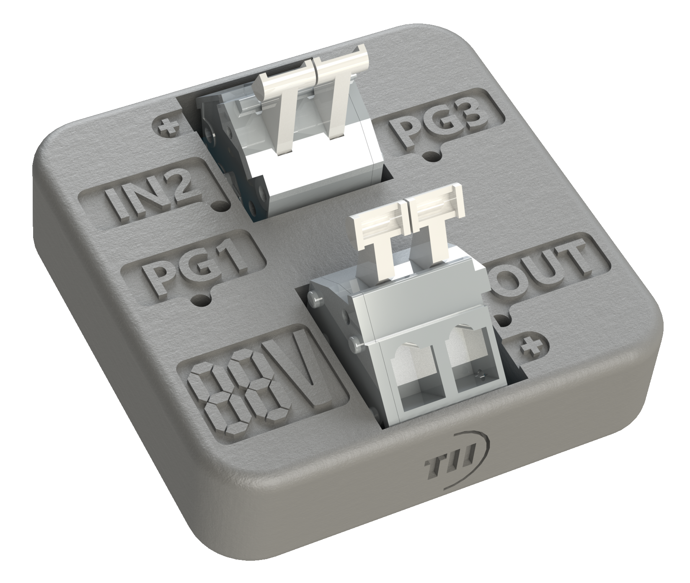
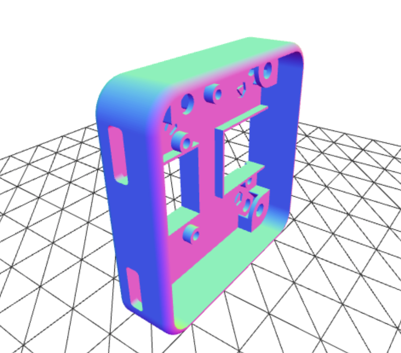

Files are made to be printed in SLS nylon for the Formlabs Fuse 1 printer. Tolerances may need to adjusted for other printers.

You will also need three M3 nuts and flat head M3 screws between 7-9 mm long (10mm will work if not tightened).

The intention behind the 7-segment caracters beside the output is to write down the selected PD voltage. Use whiteout for a dark material, or a marker for a lighter material. You can also use a chisel to remove the other segments, or remove them from the 3D model.

     

You can preview the case by clicking on the STL files included in this folder and using the GitHub integrated viewer. Click on the below image to open the file.

 
  
   
  

